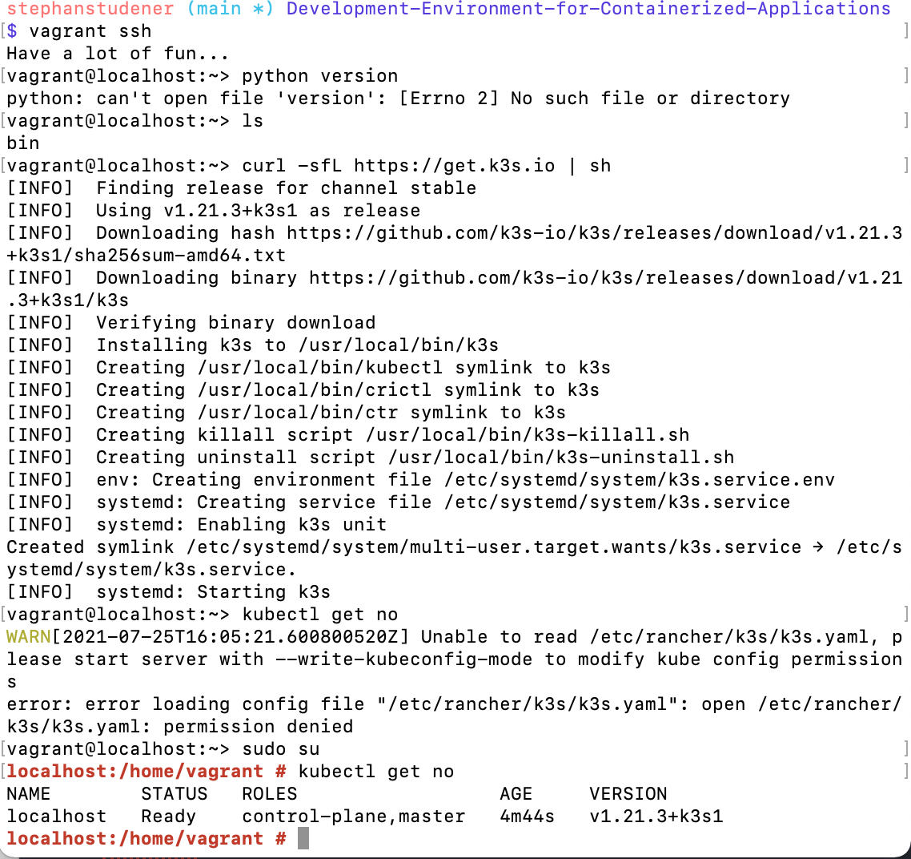

# Development-Environment-for-Containerized-Applications
This repository holds infrastructure as code that spins up a virtual development environment for containerized applications (Docker-Containers hosted in a Kubernetes Cluster).
The virtual environment is a virtual machine running in virtual box. The machine is defined by a Vagrantfile; to distribute the environment, only this file is needed. The most important advantage of using Vagrant is that it can be ported to any operating system - so everyone will have the same environment independent of his or her host system (MacOs, Windows, some Linux-Distribution).
Once the machine is generated by Vagrant, the cluster is desployed and put into operation on the virtual machine.  

## Creating the Virtual Machine Image with Vagrant
After installing dependencies, ensure [Vagrant](https://www.vagrantup.com/) is ready on your machine by running

'vagrant version'

In this directory, run

'vagrant up'

in order to let Vagrant follow the instructions contained in the Vagrantfile. This may take some time. At some point the command line output should be

'==> default: Machine booted and ready!'

Then, verify, that your machine is ready by running

'vagrant status'

This command should return

'default                   running (virtualbox)'

Furthermore, a '.vagrant'-folder has been created in this directory. You must also be able to see the machine in [VirtualBox](https://www.virtualbox.org/wiki/Downloads), as shown in the figure below.

We can ssh into the machine now by from the console

'vagrant ssh'

This commands automatically identifies the box and ssh'es into it because all necessary information is kept in the '.vagrant'-folder.

## Creating the Kubernetes Cluster with K3S
After successfully logging into the machine created by Vagrant, we are ready to install the Kubernetes Cluster with [K3S](https://k3s.io/). Go to [this](https://k3s.io/) page and copy the command to deploy K3S in the machine:

'curl -sfL https://get.k3s.io | sh'

K3S will download any binaries required to run an operational cluster. successfully installing K3S will finish with the following output at the command line

'systemd: Starting k3s'

The next step is to enable interaction with the cluster via kubectl - Kubernetes' Command-Line API -  e.g. running 'kubectl get no'. To do so, cast yourself into a superuser by running

'sudo su' followed by 'kubectl get no'

This sequence of commands must confirm, that the cluster is up and running by confirming that a master node is in status 'READY'.
The command line should look like the one displayed in the figure below

To exit the virtual machine, just run

'exit'

## Stoping and Deleting the Virtual Machine
If your Vagrant box is still running, make sure it is shutdown by running

'vagrant halt'

To destroy the machine, run

'vagrant destroy' or (if you receive an error) 'vagrant destroy -f'

More commands on backup and restore of the machine with Vagrant can be found [here](https://www.webfoobar.com/node/52).

## Dependencies
This project depends on the following solutions:+
* [Vagrant](https://www.vagrantup.com/) defines an image that runs the development environment.
* [VirtualBox](https://www.virtualbox.org/wiki/Downloads) is needed to run the image, that is created with Vagrant.
* [K3S](https://k3s.io/), the Kubernetes distribution that runs the containers.
